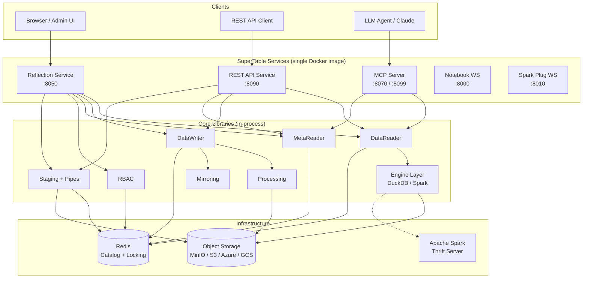
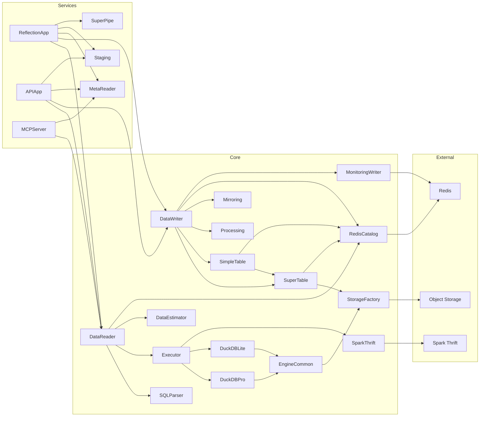
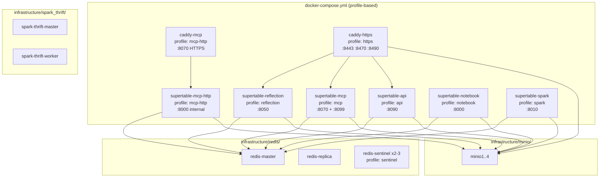
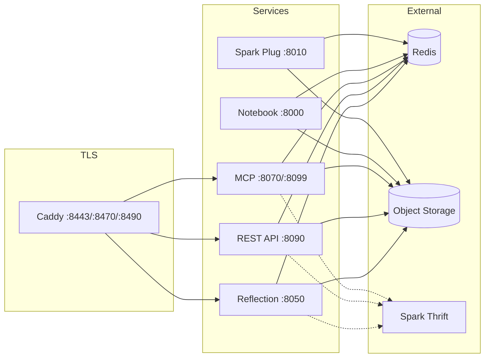
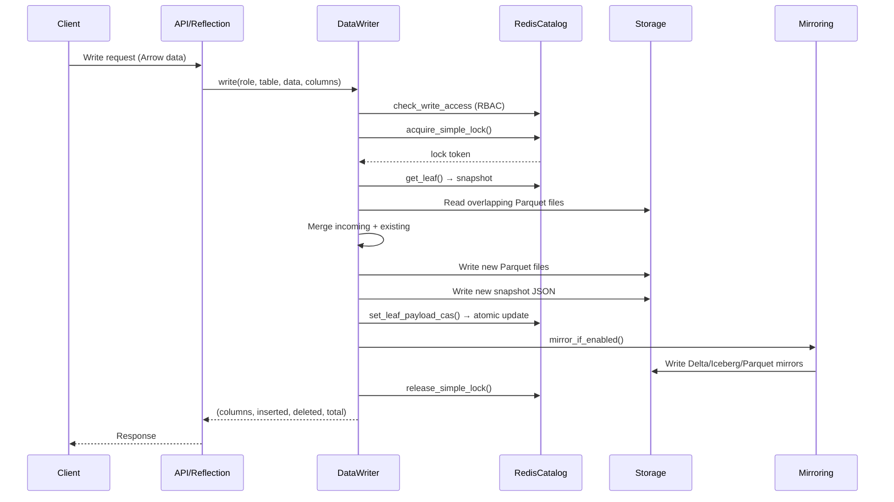
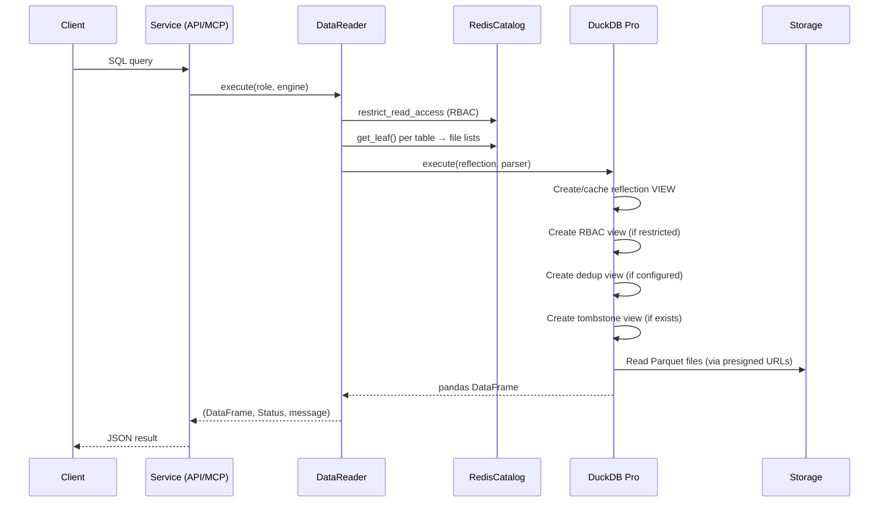
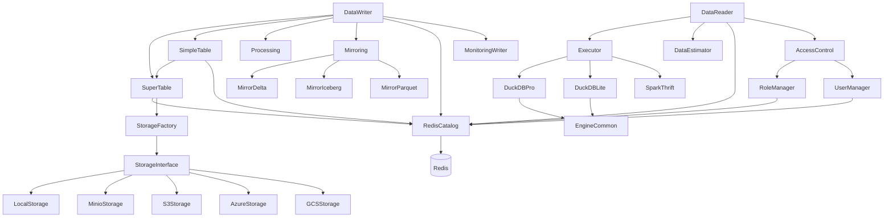

# SuperTable — Full Code-Based Reverse-Engineered Documentation

**Version analysed:** 1.9.5  
**Analysis date:** 2025-03-25  
**Analysis method:** Source-code-only reverse engineering  
**Repository:** `kladnasoft/supertable` — `supertable/` subdirectory + root `docker-compose.yml`

---

## Table of Contents

1. [Executive Summary](#1-executive-summary)
2. [Analysis Method and Evidence Policy](#2-analysis-method-and-evidence-policy)
3. [Repository Structure Overview](#3-repository-structure-overview)
4. [Technology Stack](#4-technology-stack)
5. [Product Interpretation from Code](#5-product-interpretation-from-code)
6. [Runtime Topology](#6-runtime-topology)
7. [High-Level Architecture](#7-high-level-architecture)
8. [Low-Level Architecture](#8-low-level-architecture)
9. [Dependency Graph](#9-dependency-graph)
10. [Module and Component Design Catalog](#10-module-and-component-design-catalog)
11. [Frontend / UI Documentation](#11-frontend--ui-documentation)
12. [Backend Documentation](#12-backend-documentation)
13. [Data Model Documentation](#13-data-model-documentation)
14. [Feature-by-Feature Documentation](#14-feature-by-feature-documentation)
15. [API and Integration Surface](#15-api-and-integration-surface)
16. [Docker / Infrastructure / Deployment](#16-docker--infrastructure--deployment)
17. [End-to-End Technical Flows](#17-end-to-end-technical-flows)
18. [Risks, Unknowns, and Ambiguities](#18-risks-unknowns-and-ambiguities)
19. [Evidence Index](#19-evidence-index)
20. [Appendix: Architecture Diagrams](#20-appendix-architecture-diagrams)

---

# 1. Executive Summary

SuperTable is a **multi-tenant, append-oriented analytical data management platform** that organises data into hierarchical **SuperTable → SimpleTable** structures, stores data as Parquet files on pluggable object storage (MinIO, S3, Azure Blob, GCS, or local filesystem), uses **Redis** as its metadata catalog and distributed locking backend, and exposes data through **DuckDB** (and optionally **Apache Spark**) query engines. **Confidence: HIGH.**

Its core capabilities, all directly provable from the code, are:

- **Tabular data ingestion** via Arrow/Parquet writes with column-level overlap detection, dedup-on-read, tombstone-based soft deletes, and newer-than filtering.
- **SQL query execution** over the managed Parquet files via an embedded DuckDB engine (with a persistent "Pro" executor and a per-query "Lite" executor) and an optional Spark Thrift connector.
- **Role-based access control (RBAC)** with five role types (superadmin, admin, writer, reader, meta), row-level and column-level security, and per-table permission scoping.
- **A server-rendered admin UI** ("Reflection") implemented as a Jinja2-based FastAPI application with pages for table management, SQL execution, data ingestion, monitoring, RBAC, secrets vault, compute pool management, notebook/studio, scheduling, and environment/env management.
- **A REST API** service with SQL execution, data upload, schema/stats retrieval, and staging operations.
- **A Model Context Protocol (MCP) server** exposing read-only SQL querying, metadata inspection, feedback collection, annotation storage, and app-state management tools for integration with LLM agents such as Claude.
- **Data mirroring** to Delta Lake, Apache Iceberg, and flat Parquet directory layouts.
- **Staging areas and pipes** for structured batch ingestion workflows.

The system is designed for **self-hosted deployment** in Docker Compose with profile-based service selection, and can optionally be fronted by Caddy for TLS termination.

---

# 2. Analysis Method and Evidence Policy

This document was produced **exclusively from source code analysis**. The following rules were applied:

- All `.md`, `README`, `txt`, `CHANGELOG`, `LICENSE`, `CONTRIBUTING`, `docs/`, `.github/`, and any hand-written documentation files were **ignored** as interpretive sources.
- The `pyproject.toml` `description` field was noted but **not** used as a primary product interpretation — all claims derive from code behaviour.
- Evidence is cited as file paths, class names, function names, route definitions, data classes, configuration keys, or test scenario names.
- Inline code comments and docstrings were used only as **secondary corroborating evidence**, never as the sole basis for a claim.

### Confidence System

| Level | Meaning |
|---|---|
| **HIGH** | Directly and unambiguously provable from code (e.g., a route exists, a class has a method, a dataclass defines fields). |
| **MEDIUM** | Strong supporting evidence but some inference required (e.g., a feature is partially implemented, or behaviour is implied by naming + structure). |
| **LOW** | Indirect evidence only — probable but not certain. |

---

# 3. Repository Structure Overview

The analysed scope is the `supertable/` Python package plus the root-level `docker-compose.yml`, `Dockerfile`, `entrypoint.sh`, `.env`, `requirements.txt`, `pyproject.toml`, and `Caddyfile.https`.

### Top-Level Package Structure

| Directory / File | Role |
|---|---|
| `supertable/api/` | REST API service (FastAPI) |
| `supertable/config/` | Defaults, home directory resolution, .env loading |
| `supertable/engine/` | Query execution engines (DuckDB Lite, DuckDB Pro, Spark Thrift) |
| `supertable/infrastructure/` | Docker Compose definitions for Redis, MinIO, Spark Thrift, Spark Worker, Python Worker |
| `supertable/locking/` | Distributed locking facade (Redis-backed, file-backed) |
| `supertable/mcp/` | MCP server, MCP client, web tester UI, simulator |
| `supertable/mirroring/` | Data mirroring to Delta, Iceberg, Parquet directory |
| `supertable/rbac/` | Role-based access control: role manager, user manager, permissions, filter builder, row/column security |
| `supertable/reflection/` | Admin UI + REST routes (FastAPI + Jinja2 templates) |
| `supertable/storage/` | Pluggable storage abstraction (local, MinIO, S3, Azure, GCS) |
| `supertable/tests/` | Core unit/integration tests |
| `supertable/utils/` | SQL parser, helper functions, timer utility |
| `supertable/data_classes.py` | Core domain dataclasses (TableDefinition, Reflection, RbacViewDef, DedupViewDef, TombstoneDef) |
| `supertable/data_reader.py` | Read facade — orchestrates estimation, engine selection, query execution |
| `supertable/data_writer.py` | Write facade — orchestrates validation, locking, overlap detection, file writes, mirroring |
| `supertable/super_table.py` | SuperTable entity — top-level data container |
| `supertable/simple_table.py` | SimpleTable entity — individual table within a SuperTable |
| `supertable/redis_catalog.py` | Redis-based metadata catalog (~1700 lines) |
| `supertable/processing.py` | Core file-level processing: overlap detection, merge, compaction, tombstones |
| `supertable/staging_area.py` | Staging area management for batch ingestion |
| `supertable/super_pipe.py` | Pipe management linking staging areas to target tables |
| `supertable/meta_reader.py` | Metadata reading (table listing, schema, stats, super-level meta) |
| `supertable/monitoring_writer.py` | Async metric logging to Redis (write/read monitoring) |
| `supertable/monitoring_reader.py` | Reading back monitoring metrics |
| `supertable/history_cleaner.py` | Garbage collection of stale snapshot files and data files |
| `supertable/query_plan_manager.py` | Query plan tracking (hash, temp dirs, profiles) |
| `supertable/plan_extender.py` | Enriches execution plans with timing and stats |

**Architecture type:** Single Python package, multiple service entry points selected at runtime by `SERVICE` environment variable (via `entrypoint.sh`). **Not a monorepo** — all services share the same codebase. **Confidence: HIGH.**

---

# 4. Technology Stack

| Category | Technology | Evidence |
|---|---|---|
| **Language** | Python 3.10+ | `pyproject.toml` requires-python |
| **Web framework** | FastAPI + Uvicorn | `requirements.txt`, `reflection/application.py`, `api/application.py` |
| **Template engine** | Jinja2 | `requirements.txt`, `reflection/templates/*.html` |
| **Query engines** | DuckDB (primary), Apache Spark (optional) | `engine/duckdb_lite.py`, `engine/duckdb_pro.py`, `engine/spark_thrift.py` |
| **Data format** | Apache Parquet (via PyArrow) | `storage/storage_interface.py::write_parquet`, `processing.py` |
| **DataFrame libraries** | Polars (write path), Pandas (read results) | `data_writer.py`, `data_reader.py` |
| **SQL parsing** | sqlglot | `requirements.txt`, `utils/sql_parser.py` |
| **Metadata store** | Redis (with Sentinel HA support) | `redis_catalog.py`, `redis_connector.py` |
| **Object storage** | MinIO, AWS S3, Azure Blob, GCS, local filesystem | `storage/` module, `storage_factory.py` |
| **MCP** | Model Context Protocol SDK (`mcp>=1.1.0`) | `requirements.txt`, `mcp/mcp_server.py` |
| **Spark connectivity** | PyHive + Thrift | `requirements.txt`, `engine/spark_thrift.py` |
| **WebSocket** | `websockets` library | `requirements.txt` |
| **Encryption** | Fernet (cryptography) | `reflection/vault.py`, `reflection/fernet.py` |
| **HTTP client** | httpx | `requirements.txt` |
| **Containerisation** | Docker, Docker Compose | `Dockerfile`, `docker-compose.yml` |
| **TLS termination** | Caddy | `Caddyfile.https`, `docker-compose.yml` caddy services |
| **Build/publish** | setuptools, twine, PyPI | `pyproject.toml`, `Makefile`, `push-pypi.sh` |

---

# 5. Product Interpretation from Code

### 5.1 What is SuperTable?

SuperTable is an **analytical data lake management layer** that sits on top of object storage and provides:
1. A **versioned, snapshot-based table abstraction** where data is stored as immutable Parquet files with JSON snapshot metadata tracking all active file resources.
2. **SQL query access** via embedded DuckDB, where the engine dynamically creates views over the relevant Parquet files for each query.
3. A **multi-tenant, multi-table catalog** coordinated through Redis, where each `(organization, super_name)` pair represents a data namespace and each `simple_name` within it represents an individual table.

**Confidence: HIGH.** Evidence: `SuperTable.__init__`, `SimpleTable.__init__`, `DataReader.execute`, `DataWriter.write`, `RedisCatalog`.

### 5.2 Probable Users and Roles

The RBAC system defines five role types in `rbac/permissions.py::RoleType`:

| Role | Permissions | Probable User |
|---|---|---|
| `superadmin` | All (CONTROL, CREATE, WRITE, READ, META) | Platform administrators |
| `admin` | All | Organization administrators |
| `writer` | META, READ, WRITE | Data engineers, ETL pipelines |
| `reader` | META, READ (with row/column filtering) | Analysts, BI tools, LLM agents |
| `meta` | META only | Monitoring/metadata-only consumers |

**Confidence: HIGH.** Evidence: `rbac/permissions.py::ROLE_PERMISSIONS`.

### 5.3 Core Use Cases

1. **Ingest tabular data** — Upload Arrow/Parquet data with column-level overlap resolution. Evidence: `DataWriter.write`, `api/api.py::api_write_table`, `reflection/ingestion.py`.
2. **Query data via SQL** — Execute read-only DuckDB SQL against managed tables. Evidence: `DataReader.execute`, `data_reader.py::query_sql`, `mcp/mcp_server.py::query_sql`.
3. **Manage table lifecycle** — Create/delete SuperTables and SimpleTables, configure dedup, view schema/stats. Evidence: `reflection/tables.py`, `reflection/admin.py`.
4. **Batch ingestion via staging + pipes** — Upload files to staging areas, define pipes that route staged data to target tables. Evidence: `staging_area.py`, `super_pipe.py`, `reflection/ingestion.py`.
5. **Mirror data to open formats** — Automatically maintain Delta Lake, Iceberg, or Parquet directory mirrors. Evidence: `mirroring/mirror_formats.py`, `mirroring/mirror_delta.py`, `mirroring/mirror_iceberg.py`.
6. **LLM agent integration** — Expose data to AI agents via MCP tools with catalog, feedback, and annotation systems. Evidence: `mcp/mcp_server.py`.
7. **Administer RBAC** — Create roles and users, assign permissions, configure row/column security. Evidence: `reflection/rbac.py`, `reflection/users.py`, `reflection/security.py`.
8. **Monitor operations** — View read/write metrics. Evidence: `monitoring_writer.py`, `monitoring_reader.py`, `reflection/monitoring.py`.
9. **Manage secrets** — Vault for encrypted environment variables with Fernet encryption. Evidence: `reflection/vault.py`.
10. **Schedule notebook jobs** — Create cron-based schedules for notebook code execution. Evidence: `reflection/jobs.py`.

**Confidence: HIGH** for items 1–6, 8. **MEDIUM** for items 7, 9, 10 (full UI wiring confirmed but some flows rely on templates not fully inspected).

---

# 6. Runtime Topology

The system comprises **six independently deployable service profiles** sharing the same Docker image, plus external infrastructure:

| Service | Profile | Port | Entry Point | Protocol |
|---|---|---|---|---|
| Reflection (Admin UI + API) | `reflection` | 8050 | `supertable.reflection.application` | HTTP (FastAPI) |
| REST API | `api` | 8090 | `supertable.api.application` | HTTP (FastAPI) |
| MCP Server | `mcp` | 8070 (HTTP) + 8099 (Web UI) | `supertable/mcp/mcp_server.py` | stdio + streamable-http + HTTP |
| MCP HTTP (legacy) | `mcp-http` | 8000 (internal) → 8070 via Caddy | `supertable/mcp/mcp_server.py` | streamable-http |
| Notebook | `notebook` | 8000 | `supertable/notebook/ws_server.py` | WebSocket |
| Spark Plug | `spark` | 8010 | `supertable/spark_plug/ws_server.py` | WebSocket |

**External dependencies (mandatory):**
- **Redis** (with optional Sentinel HA) — metadata catalog, locking, monitoring, RBAC state, staging metadata, pipe definitions, session data.
- **Object storage** (MinIO by default, also S3/Azure/GCS/local) — Parquet data files, snapshot JSONs.

**External dependencies (optional):**
- **Apache Spark** (Thrift Server) — alternative/overflow query engine for large datasets.
- **Caddy** — TLS sidecar (profile `https`).

**Confidence: HIGH.** Evidence: `docker-compose.yml`, `entrypoint.sh`, `Dockerfile`.

---

# 7. High-Level Architecture



### Key Architectural Boundaries

1. **Service boundary:** Each service profile exposes different endpoints but shares the same in-process library code. No inter-service RPC — all communication is via shared Redis + object storage state.
2. **Storage boundary:** All heavy data (Parquet files, snapshot JSONs) lives in object storage. All metadata (catalog pointers, RBAC, configs, monitoring) lives in Redis.
3. **Engine boundary:** Query execution is delegated to DuckDB (in-process) or Spark (remote via Thrift). Engine selection is automatic (by data size) or explicit.
4. **Security boundary:** RBAC checks happen in `rbac/access_control.py` before any read or write operation. Row/column filtering is implemented as DuckDB views wrapping the base reflection views.

**Confidence: HIGH.**

---

# 8. Low-Level Architecture

### 8.1 Layer Structure

The codebase follows a **facade + engine + storage** layered pattern:

```
┌──────────────────────────────────────────────┐
│ Service Layer (FastAPI routes / MCP tools)    │
├──────────────────────────────────────────────┤
│ Facade Layer (DataReader, DataWriter,        │
│              MetaReader, Staging, SuperPipe)  │
├──────────────────────────────────────────────┤
│ Domain Layer (SuperTable, SimpleTable,        │
│              Processing, Mirroring, RBAC)     │
├──────────────────────────────────────────────┤
│ Engine Layer (DuckDB Lite/Pro, Spark Thrift,  │
│              DataEstimator, Executor)         │
├──────────────────────────────────────────────┤
│ Persistence Layer (StorageInterface impls,    │
│                    RedisCatalog)              │
└──────────────────────────────────────────────┘
```

### 8.2 Hívási Lánc (Call Chain) — Read Path

```
API/MCP route
  → DataReader.__init__(super_name, organization, query)
    → SQLParser(query) — parse table references
  → DataReader.execute(role_name, engine)
    → restrict_read_access() — RBAC check
    → Executor.__init__()
    → DataEstimator.estimate()
      → RedisCatalog.get_leaf() per table
      → Collect Parquet file lists from snapshots
    → Build Reflection object with file lists, RBAC views, dedup views, tombstone views
    → Executor.execute()
      → DuckDBPro.execute() / DuckDBLite.execute() / SparkThriftExecutor.execute()
        → configure_httpfs_and_s3() — S3 credentials for DuckDB
        → create_reflection_view() — DuckDB VIEW over Parquet files
        → create_rbac_view() — row/column filtered view on top
        → create_dedup_view() — ROW_NUMBER window view on top
        → create_tombstone_view() — WHERE NOT IN filtered view on top
        → Execute rewritten SQL against the view stack
    → Return pd.DataFrame
```

### 8.3 Hívási Lánc — Write Path

```
API/Reflection route
  → DataWriter.__init__(super_name, organization)
  → DataWriter.write(role_name, simple_name, data, overwrite_columns, ...)
    → check_write_access() — RBAC
    → polars.from_arrow(data) — convert to Polars DataFrame
    → Inject __timestamp__ if dedup-on-read configured
    → validation() — schema checks
    → RedisCatalog.acquire_simple_lock() — distributed lock
    → SimpleTable.get_simple_table_snapshot() — current state
    → find_and_lock_overlapping_files() — detect affected files
    → filter_stale_incoming_rows() — newer-than filtering
    → process_overlapping_files() — merge incoming + existing
      → Read overlapping Parquet files from storage
      → Merge DataFrames
      → Write new Parquet files to storage
      → Collect resource metadata
    → SimpleTable.update() — write new snapshot JSON
    → RedisCatalog.set_leaf_payload_cas() — atomic pointer update
    → MirrorFormats.mirror_if_enabled() — Delta/Iceberg/Parquet mirroring
    → RedisCatalog.release_simple_lock()
    → MonitoringWriter.log_metric() — async metrics
```

### 8.4 State Management Pattern

All mutable state is coordinated through Redis with an **optimistic concurrency control** model:

1. **Leaf pointers** (`meta:leaf:{org}:{super}:{simple}`) contain a JSON hash with `path` (pointing to the current snapshot JSON on storage) and optionally `payload` (an inline copy of the snapshot for fast reads).
2. **Root pointer** (`meta:root:{org}:{super}`) tracks the SuperTable version and timestamp.
3. **Writes** acquire a per-SimpleTable distributed lock via Redis SET NX with TTL. The lock is released after the snapshot pointer is atomically updated.
4. **Reads** do not acquire locks — they read the current leaf pointer (a fast Redis GET) and then query the referenced Parquet files.

**Confidence: HIGH.** Evidence: `redis_catalog.py`, `data_writer.py`, `data_reader.py`, `simple_table.py`.

---

# 9. Dependency Graph

### 9.1 Technical Dependency Graph



### 9.2 Logical Dependency Graph

| From | To | Relationship |
|---|---|---|
| UI (Reflection templates) | Reflection FastAPI routes | HTTP requests (AJAX + form submits) |
| Reflection routes | DataReader / DataWriter / MetaReader | Direct Python calls |
| REST API routes | DataReader / DataWriter / MetaReader | Direct Python calls |
| MCP tools | DataReader / MetaReader | Direct Python calls (via anyio thread pool) |
| DataReader | Executor → DuckDB/Spark | Query delegation |
| DataWriter | Processing module | File overlap resolution |
| DataWriter | Mirroring module | Post-write mirror dispatch |
| All services | RedisCatalog | Metadata CRUD, locking |
| All services | StorageInterface | Data file I/O |

### 9.3 Runtime Dependency Graph

| Component | Requires Running |
|---|---|
| Any SuperTable service | Redis (mandatory), Object Storage (mandatory) |
| Reflection service | Redis, Object Storage |
| REST API service | Redis, Object Storage |
| MCP service | Redis, Object Storage |
| Spark engine queries | Redis, Object Storage, Spark Thrift Server |
| Notebook service | Redis, Object Storage, Python Worker (infrastructure) |
| TLS access | Caddy sidecar |

### 9.4 Critical Central Modules

The highest-coupling modules (imported most widely):

1. `redis_catalog.py` — ~1700 lines, used by virtually every other module
2. `storage/storage_factory.py` + `storage_interface.py` — all data I/O
3. `config/defaults.py` — logger, default config
4. `data_classes.py` — shared domain types
5. `rbac/access_control.py` — called on every read and write

**Confidence: HIGH.**

---

# 10. Module and Component Design Catalog

### 10.1 `SuperTable` (`super_table.py`)

- **Type:** Domain entity
- **Responsibility:** Represents a top-level data namespace (org + super_name). Ensures storage directories and Redis root pointer exist. Provides `delete()` for full cleanup.
- **Pattern:** Coordinator / Aggregate Root. Does not contain business logic itself but wires storage + catalog.
- **Dependencies:** `StorageInterface`, `RedisCatalog`, `RoleManager`, `UserManager`
- **Confidence: HIGH**

### 10.2 `SimpleTable` (`simple_table.py`)

- **Type:** Domain entity
- **Responsibility:** Represents an individual table within a SuperTable. Manages the snapshot lifecycle (init, read, update, delete). Snapshot is a JSON document containing the list of active Parquet file resources, schema, and version.
- **Pattern:** Entity with CAS (Compare-And-Swap) update semantics via Redis leaf pointer.
- **Key methods:** `get_simple_table_snapshot()`, `update()`, `delete()`
- **Dependencies:** `SuperTable`, `StorageInterface`, `RedisCatalog`
- **Confidence: HIGH**

### 10.3 `DataReader` (`data_reader.py`)

- **Type:** Facade
- **Responsibility:** Orchestrates a full read query: RBAC check → estimation → engine execution → plan extension.
- **Pattern:** Facade delegating to `DataEstimator`, `Executor`, `QueryPlanManager`.
- **Key method:** `execute(role_name, with_scan, engine)` → returns `(pd.DataFrame, Status, message)`
- **Also exposes:** Module-level `query_sql()` convenience function used by MCP and API.
- **Confidence: HIGH**

### 10.4 `DataWriter` (`data_writer.py`)

- **Type:** Facade
- **Responsibility:** Orchestrates a full write operation: access control → validation → locking → overlap detection → newer-than filtering → tombstone handling → file processing → snapshot update → mirroring → monitoring.
- **Pattern:** Template Method with extensive try/finally for lock release.
- **Key methods:** `write()`, `configure_table()`, `validation()`
- **Confidence: HIGH**

### 10.5 `RedisCatalog` (`redis_catalog.py`)

- **Type:** Data access / Catalog
- **Responsibility:** All Redis-based metadata operations. Manages root/leaf pointers, distributed locks, RBAC user/role storage, auth tokens, mirror config, staging/pipe metadata, table config, Spark cluster registry, monitoring stats.
- **Size:** ~1700 lines, ~60+ methods.
- **Pattern:** Repository / Active Record hybrid — single class aggregating all Redis key spaces.
- **Key sections:** Root/leaf management, lock acquisition/release (Lua scripts), RBAC CRUD, staging/pipe metadata, Spark cluster registry, table config.
- **Confidence: HIGH**

### 10.6 `Processing` (`processing.py`)

- **Type:** Core business logic
- **Responsibility:** File-level overlap detection, merge, compaction, tombstone reconciliation.
- **Key functions:**
  - `find_and_lock_overlapping_files()` — identifies which existing Parquet files overlap with incoming data based on overwrite columns.
  - `process_overlapping_files()` — reads overlapping files, merges with incoming data, writes new Parquet files.
  - `process_delete_only()` — handles soft-delete-via-overlap (removes matching rows from overlapping files without adding new data).
  - `filter_stale_incoming_rows()` — filters out incoming rows that are older than existing rows (based on a timestamp column).
  - `compact_tombstones()` — physically removes tombstoned rows from Parquet files when tombstone count exceeds threshold.
- **Confidence: HIGH**

### 10.7 `Executor` (`engine/executor.py`)

- **Type:** Strategy dispatcher
- **Responsibility:** Selects and invokes the appropriate query engine.
- **Pattern:** Strategy pattern with auto-selection heuristic (DuckDB Pro for most queries, Spark for >10 GiB datasets).
- **Engines:** `DuckDBLite` (per-query in-memory connection), `DuckDBPro` (persistent singleton connection with view caching), `SparkThriftExecutor` (remote Spark via Thrift).
- **Confidence: HIGH**

### 10.8 `DuckDBPro` (`engine/duckdb_pro.py`)

- **Type:** Query executor
- **Responsibility:** Maintains a persistent DuckDB connection with version-based view caching. Creates reflection views (direct Parquet file reads), RBAC views, dedup views, and tombstone views as a layered stack.
- **Pattern:** Singleton (module-level `_pro_singleton`), View Cache with reference counting and staleness tracking.
- **Confidence: HIGH**

### 10.9 `StorageInterface` + Implementations (`storage/`)

- **Type:** Abstract interface + concrete adapters
- **Responsibility:** Unified file I/O across local filesystem, MinIO, S3, Azure Blob, GCS.
- **Pattern:** Strategy / Adapter via `StorageFactory.get_storage()`.
- **Methods:** `read_json`, `write_json`, `exists`, `size`, `makedirs`, `list_files`, `delete`, `write_parquet`, `read_parquet`, `write_bytes`, `read_bytes`, `write_text`, `read_text`, `copy`, `to_duckdb_path`, `presign`.
- **Implementations:** `LocalStorage`, `MinioStorage`, `S3Storage`, `AzureBlobStorage`, `GCSStorage`.
- **Selection:** `STORAGE_TYPE` env var (LOCAL | MINIO | S3 | AZURE | GCS).
- **Confidence: HIGH**

### 10.10 `RBAC Module` (`rbac/`)

- **Type:** Cross-cutting security module
- **Components:**
  - `permissions.py` — Role types and permission mapping.
  - `role_manager.py` — CRUD for roles in Redis.
  - `user_manager.py` — CRUD for users in Redis.
  - `access_control.py` — `check_write_access()`, `restrict_read_access()`, `check_meta_access()`.
  - `filter_builder.py` — Builds SQL WHERE clauses from role filter definitions.
  - `row_column_security.py` — Row-level and column-level security definitions.
- **Pattern:** Policy-based access control with role → permission mapping.
- **Confidence: HIGH**

### 10.11 `Mirroring Module` (`mirroring/`)

- **Type:** Post-write hook
- **Responsibility:** Maintains format-specific mirrors of table data.
- **Supported formats:** Delta Lake (`mirror_delta.py`), Apache Iceberg (`mirror_iceberg.py`), Parquet directory (`mirror_parquet.py`).
- **Configuration:** Redis-stored list of enabled formats per SuperTable, toggled via `MirrorFormats.enable_with_lock()` / `disable_with_lock()`.
- **Trigger:** Called by `DataWriter` after successful snapshot update.
- **Confidence: HIGH**

### 10.12 `MCP Server` (`mcp/mcp_server.py`)

- **Type:** Integration service
- **Responsibility:** Exposes SuperTable capabilities as MCP tools for LLM agents.
- **Tools:** `health`, `info`, `whoami`, `list_supers`, `list_tables`, `describe_table`, `get_table_stats`, `get_super_meta`, `query_sql`, `sample_data`, `submit_feedback`, `store_annotation`, `get_annotations`, `store_app_state`, `get_app_state`.
- **Transports:** stdio (foreground), streamable-http (background), web tester UI.
- **Security:** Token-based auth (`SUPERTABLE_MCP_AUTH_TOKEN`), role-based read restrictions, SQL read-only enforcement.
- **Pattern:** Tool registration via `@mcp.tool()` decorators, async execution via `anyio.to_thread.run_sync()` with capacity limiter.
- **Confidence: HIGH**

### 10.13 `Staging` (`staging_area.py`) + `SuperPipe` (`super_pipe.py`)

- **Type:** Ingestion pipeline components
- **Staging:** File landing zone with Redis-registered metadata, Parquet file index, per-stage locking.
- **Pipe:** Named route from a staging area to a target SimpleTable with column mapping, enable/disable, duplicate prevention.
- **Confidence: HIGH**

### 10.14 `Locking` (`locking/`)

- **Type:** Infrastructure utility
- **Responsibility:** Distributed locking facade supporting Redis (primary) and file-based (fallback) backends.
- **Pattern:** Facade + Strategy.
- **Redis locking:** Uses `SET NX EX` + Lua compare-and-delete for safe release.
- **Confidence: HIGH**

---

# 11. Frontend / UI Documentation

The admin UI is a **server-rendered Jinja2 SPA-like application** served by the Reflection FastAPI service. It uses AJAX calls to API endpoints and renders HTML templates.

### 11.1 Navigation / Menu Structure

Evidence: `reflection/templates/sidebar.html`

| Menu Item | Route | Template | Purpose |
|---|---|---|---|
| Home | `/reflection/home` | `home.html` | Dashboard / overview |
| Execute | `/reflection/execute` | `execute.html` | SQL query workbench |
| Tables | `/reflection/tables` | `tables.html` | Table management (list, schema, stats, config) |
| Ingestion | `/reflection/ingestion` | `ingestion.html` | Staging areas, pipes, data upload |
| Studio | `/reflection/studio` | `studio.html` | Notebook / code editor environment |
| Jobs | `/reflection/jobs` | `jobs.html` | Scheduled notebook execution |
| Monitoring | `/reflection/monitoring` | `monitoring.html` | Read/write monitoring metrics |
| Vault | `/reflection/vault` | `vault.html` | Encrypted secrets management |
| Compute | `/reflection/compute` | `compute.html` | Compute pool and Spark cluster management |
| Security | `/reflection/security` | `security.html` | Security overview / RBAC quick view |
| Logout | `/reflection/logout` | — | Session termination |

### 11.2 Authentication

- **Login:** Cookie-based session with HMAC-signed payload. Evidence: `reflection/common.py::_encode_session`, `_decode_session`, `_sign_payload`.
- **Login flow:** POST to `/reflection/login` with username + password hash. Validated against Redis-stored user hashes. Evidence: `common.py::router.post("/reflection/login")`.
- **Admin guard:** Separate admin role check for privileged operations. Evidence: `reflection/admin.py::admin_guard_api`.
- **Login mask:** Configurable via `SUPERTABLE_LOGIN_MASK` env var.

### 11.3 Key Screens

**Execute page** (`execute.html`, 196 KB) — Full SQL workbench with query editor, engine selection (DuckDB Lite/Pro/Spark/Auto), result grid, column metadata, query plan viewer. Evidence: `reflection/execute.py::attach_execute_routes`.

**Tables page** (`tables.html`, 117 KB) — Table listing, schema viewer, statistics, table configuration (dedup, primary keys, compaction settings), table deletion, leaf pointer inspection. Evidence: `reflection/tables.py`.

**Ingestion page** (`ingestion.html`, 55 KB) — Staging area CRUD, pipe CRUD (create linking staging → table with overwrite columns), file upload to staging, pipe enable/disable, recent writes timeline. Evidence: `reflection/ingestion.py`.

**Studio page** (`studio.html`, 107 KB) — Notebook-style code editor with cell execution, kernel management, connector definitions for compute pools. Evidence: `reflection/studio.py`.

**RBAC page** (`rbac.html`, 37 KB) — Role CRUD (create/edit/delete roles with type, tables, columns, filters), user CRUD, role assignment. Evidence: `reflection/rbac.py`.

**Users page** (`users.html`, 41 KB) — User management, role assignment to users, API token management. Evidence: `reflection/users.py`.

**Vault page** (`vault.html`, 54 KB) — Fernet-encrypted key-value secrets, environment stages (dev/staging/prod), export functionality with link rotation. Evidence: `reflection/vault.py`.

**Compute page** (`compute.html`, 57 KB) — Compute pool management, Spark Thrift Server registration/status, Spark Plug registration/status, connection testing. Evidence: `reflection/compute.py`.

**Jobs page** (`jobs.html`, 24 KB) — Cron-based scheduled notebook jobs, run history, manual trigger. Evidence: `reflection/jobs.py`.

**Monitoring page** (`monitoring.html`, 42 KB) — Read and write monitoring metrics with timeline. Evidence: `reflection/monitoring.py`.

**Confidence: HIGH** for all items. Evidence: template file existence + route handlers.

---

# 12. Backend Documentation

### 12.1 API Surface — REST API Service (`:8090`)

| Method | Endpoint | Purpose | Auth |
|---|---|---|---|
| POST | `/api/v1/execute` | Execute SQL query | API Key / Bearer |
| POST | `/api/v1/write` | Write Arrow table to a SimpleTable | API Key / Bearer |
| POST | `/api/v1/stage/upload` | Upload file to a staging area | API Key / Bearer |
| GET | `/api/v1/supers` | List SuperTables in organization | API Key / Bearer |
| GET | `/api/v1/tables` | List SimpleTables in a SuperTable | API Key / Bearer |
| GET | `/api/v1/super` | Get SuperTable metadata | API Key / Bearer |
| GET | `/api/v1/schema` | Get table schema | API Key / Bearer |
| GET | `/api/v1/stats` | Get table statistics | API Key / Bearer |
| GET | `/api/v1/table/{simple_name}` | Get table leaf pointer details | API Key / Bearer |
| GET | `/healthz` | Health check (no auth) | None |

**Auth modes:** `api_key` (default, via `X-API-Key` header) or `bearer` (via `Authorization: Bearer <token>`). Configured by `SUPERTABLE_AUTH_MODE`. Evidence: `api/auth.py::AuthConfig`.

### 12.2 API Surface — MCP Tools

| Tool | Parameters | Purpose |
|---|---|---|
| `health` | — | Health check |
| `info` | — | Server configuration info |
| `whoami` | role, auth_token | Resolve effective role |
| `list_supers` | organization | List SuperTables |
| `list_tables` | super_name, organization | List tables (+ catalog, feedback, annotations if `__catalog__`/`__feedback__`/`__annotations__` tables exist) |
| `describe_table` | super_name, organization, table | Table schema |
| `get_table_stats` | super_name, organization, table | Table stats |
| `get_super_meta` | super_name, organization | Full SuperTable metadata |
| `query_sql` | super_name, organization, sql, limit, engine, query_timeout_sec | Execute read-only SQL |
| `sample_data` | super_name, organization, table, limit | Quick table preview |
| `submit_feedback` | super_name, organization, rating, query, response_summary | Write to `__feedback__` table |
| `store_annotation` | super_name, organization, category, context, instruction | Write to `__annotations__` table |
| `get_annotations` | super_name, organization | Read all annotations |
| `store_app_state` | super_name, organization, namespace, key, value | Write to `__app_state__` table |
| `get_app_state` | super_name, organization, namespace, key | Read from `__app_state__` table |

**Security:** Token auth via `SUPERTABLE_MCP_AUTH_TOKEN`, role restriction via `SUPERTABLE_ALLOWED_ROLES`, read-only SQL enforcement via `_read_only_sql()`. Evidence: `mcp/mcp_server.py`.

### 12.3 Service Layer

The primary service objects are:

- `DataReader` — Query orchestration facade.
- `DataWriter` — Write orchestration facade.
- `MetaReader` — Metadata reading (table listing, schema, stats).
- `Staging` — Staging area management.
- `SuperPipe` — Pipe management.
- `HistoryCleaner` — Garbage collection of old snapshots and data files.
- `MonitoringWriter` / `MonitoringReader` — Metrics collection and reading.

### 12.4 Domain Logic

The core domain logic resides in `processing.py` and implements:

1. **Overlap detection:** For each existing Parquet file in the snapshot, check if any incoming rows match on the specified `overwrite_columns`. If matches exist, that file is marked as overlapping.
2. **File merge:** Overlapping files are read, incoming rows are merged (replacing matching rows), and new Parquet files are written. Non-overlapping files are preserved as-is.
3. **Chunk management:** Large DataFrames are split into chunks of `MAX_MEMORY_CHUNK_SIZE` bytes (configurable per-table).
4. **Dedup-on-read:** When configured, a `__timestamp__` column is injected on write, and the read side applies a `ROW_NUMBER() OVER (PARTITION BY pk ORDER BY __timestamp__ DESC)` window to return only the latest version of each key.
5. **Tombstone soft-deletes:** Delete operations append key tuples to a `tombstones` block in the snapshot JSON. Reads filter out tombstoned keys via a DuckDB view. When tombstone count exceeds a threshold, physical compaction removes the rows.

**Confidence: HIGH.** Evidence: `processing.py`, `data_writer.py`, `data_reader.py`, `data_classes.py`.

### 12.5 Validation

`DataWriter.validation()` checks:
- DataFrame must not be empty (unless delete_only).
- Column names must be valid (no duplicates, no reserved names).
- Overwrite columns must exist in the DataFrame.
- `newer_than` column must exist if specified.

Evidence: `data_writer.py::validation`.

### 12.6 Error Handling

- Exceptions propagate as Python exceptions and are caught at the service/route level.
- `DataReader.execute()` catches all exceptions and returns `(empty_df, Status.ERROR, message)`.
- `DataWriter.write()` uses extensive try/finally to ensure lock release.
- MCP tools catch exceptions and return structured error dicts with `status: "ERROR"`.

---

# 13. Data Model Documentation

### 13.1 Storage Layout

Data is organised in object storage as:

```
{organization}/
  {super_name}/
    super/                          # SuperTable marker directory
    tables/
      {simple_name}/
        data/                       # Parquet data files
          {timestamp}_{uuid}.parquet
        snapshots/                  # Snapshot JSON files
          {timestamp}_{uuid}.json
    staging/
      {staging_name}/              # Staging area files
        {file}.parquet
      {staging_name}_files.json    # File index
    delta/                          # Delta Lake mirror
      {simple_name}/
        _delta_log/
    iceberg/                        # Iceberg mirror
      {simple_name}/
        metadata/
        manifests/
    parquet/                        # Parquet directory mirror
      {simple_name}/
        files/
```

### 13.2 Snapshot JSON Structure

Each snapshot is a JSON document stored in object storage:

```json
{
  "simple_name": "table_name",
  "location": "org/super/tables/table_name",
  "snapshot_version": 42,
  "last_updated_ms": 1711363200000,
  "previous_snapshot": "path/to/previous.json",
  "schema": [
    {"name": "col1", "type": "string", "nullable": true, "metadata": {}}
  ],
  "schemaString": "{\"type\":\"struct\",\"fields\":[...]}",
  "resources": [
    {
      "file": "path/to/data.parquet",
      "rows": 1000,
      "columns": ["col1", "col2"],
      "statistics": {...}
    }
  ],
  "tombstones": {
    "primary_keys": ["id"],
    "deleted_keys": [[1], [2], [3]]
  }
}
```

**Confidence: HIGH.** Evidence: `simple_table.py::init_simple_table`, `simple_table.py::update`, `data_writer.py`.

### 13.3 Redis Key Schema

| Key Pattern | Type | Content |
|---|---|---|
| `supertable:{org}:{sup}:meta:root` | Hash | `version`, `ts` |
| `supertable:{org}:{sup}:meta:leaf:{simple}` | Hash | `path`, `version`, `ts`, `payload` |
| `supertable:{org}:{sup}:lock:{simple}` | String (NX) | Lock token |
| `supertable:{org}:{sup}:meta:mirrors` | Hash | `formats: [...]`, `ts` |
| `supertable:{org}:{sup}:meta:staging:{stage}` | Hash | Staging metadata |
| `supertable:{org}:{sup}:meta:stagings` | Set | Staging name index |
| `supertable:{org}:{sup}:meta:pipe:{stage}:{pipe}` | Hash | Pipe metadata |
| `supertable:{org}:{sup}:meta:pipes:{stage}` | Set | Pipe name index |
| `supertable:{org}:{sup}:table:config:{simple}` | Hash | Table config (dedup, PK, limits) |
| `supertable:{org}:{sup}:rbac:role:meta` | Hash | Role metadata version |
| `supertable:{org}:{sup}:rbac:role:index` | Set | Role IDs |
| `supertable:{org}:{sup}:rbac:role:doc:{id}` | Hash | Role document |
| `supertable:{org}:{sup}:rbac:user:meta` | Hash | User metadata version |
| `supertable:{org}:{sup}:rbac:user:index` | Set | User IDs |
| `supertable:{org}:{sup}:rbac:user:doc:{id}` | Hash | User document |
| `supertable:{org}:auth:tokens` | Hash | API auth tokens |

**Confidence: HIGH.** Evidence: `redis_catalog.py` key functions (`_root_key`, `_leaf_key`, etc.).

### 13.4 Core Data Classes

| Class | File | Purpose |
|---|---|---|
| `TableDefinition` | `data_classes.py` | Parsed table reference (super_name, simple_name, alias, columns) |
| `SuperSnapshot` | `data_classes.py` | Table file manifest (super_name, simple_name, version, files, columns) |
| `Reflection` | `data_classes.py` | Complete query execution context (storage type, file list, RBAC/dedup/tombstone views) |
| `RbacViewDef` | `data_classes.py` | RBAC column filter + WHERE clause per table alias |
| `DedupViewDef` | `data_classes.py` | Dedup primary keys + order column per table alias |
| `TombstoneDef` | `data_classes.py` | Tombstone primary keys + deleted key tuples per table alias |

---

# 14. Feature-by-Feature Documentation

### 14.1 SQL Query Execution

- **Purpose:** Run SQL queries against managed Parquet-backed tables.
- **User value:** Ad-hoc analytics, data exploration, programmatic data access.
- **UI:** `/reflection/execute` (full workbench), MCP `query_sql` tool, REST `/api/v1/execute`.
- **Backend:** `DataReader.execute()` → `Executor` → DuckDB/Spark.
- **Data model:** `Reflection`, `SuperSnapshot` (file lists), `RbacViewDef` / `DedupViewDef` / `TombstoneDef` (view stack).
- **Engine selection:** AUTO (DuckDB Pro default, Spark for >10 GiB), or explicit selection.
- **Key mechanics:** DuckDB creates views over Parquet files using presigned URLs (MinIO/S3) or httpfs. Views are cached in DuckDB Pro.
- **Confidence: HIGH**

### 14.2 Data Ingestion (Write)

- **Purpose:** Append or upsert tabular data into SimpleTables.
- **User value:** ETL pipeline target, data loading.
- **UI:** `/reflection/ingestion` (upload), REST `/api/v1/write`.
- **Backend:** `DataWriter.write()`.
- **Key mechanics:** Column-level overlap detection → file-level merge → atomic snapshot pointer update → optional mirroring.
- **Edge cases:** newer-than filtering (skip stale rows), delete-only mode (soft-delete via tombstones), small-file compaction (merge tiny Parquet files).
- **Confidence: HIGH**

### 14.3 Staging Areas + Pipes

- **Purpose:** Two-phase ingestion: land data in staging, then route via pipes to target tables.
- **User value:** Decoupled ingestion, preview before commit, reusable routing.
- **UI:** `/reflection/ingestion` (staging CRUD, pipe CRUD, file listing).
- **Backend:** `Staging` class (file storage), `SuperPipe` class (routing metadata in Redis).
- **Data model:** Staging files in object storage, metadata in Redis.
- **Confidence: HIGH**

### 14.4 Dedup-on-Read

- **Purpose:** Maintain a latest-version-per-key view without physical deduplication.
- **User value:** Efficient upsert semantics without rewriting entire tables.
- **Configuration:** `DataWriter.configure_table(primary_keys=[...], dedup_on_read=True)`.
- **Mechanics:** Write path injects `__timestamp__` column; read path creates `ROW_NUMBER()` view.
- **Evidence:** `data_writer.py::configure_table`, `data_reader.py` dedup view creation, `engine/engine_common.py::create_dedup_view`.
- **Confidence: HIGH**

### 14.5 Tombstone Soft Deletes

- **Purpose:** Logically delete rows by primary key without immediate physical file rewrite.
- **Configuration:** Requires dedup-on-read enabled with primary keys.
- **Mechanics:** `delete_only=True` in write path → key tuples appended to snapshot `tombstones` block → read path creates exclusion view → compaction when threshold exceeded.
- **Evidence:** `data_writer.py` tombstone section, `processing.py::extract_key_tuples`, `compact_tombstones`, `engine/engine_common.py::create_tombstone_view`.
- **Confidence: HIGH**

### 14.6 Data Mirroring (Delta / Iceberg / Parquet)

- **Purpose:** Automatically maintain table mirrors in open lakehouse formats.
- **User value:** Interoperability with Spark, Trino, Presto, and other tools that read Delta/Iceberg.
- **Configuration:** Redis-stored format list per SuperTable; toggled via UI or API.
- **Backend:** `mirroring/mirror_formats.py::MirrorFormats.mirror_if_enabled()`.
- **Evidence:** `mirror_delta.py`, `mirror_iceberg.py`, `mirror_parquet.py`.
- **Confidence: HIGH**

### 14.7 RBAC (Role-Based Access Control)

- **Purpose:** Control who can read, write, and administer tables.
- **User value:** Multi-tenant security, least-privilege access.
- **UI:** `/reflection/rbac` (role CRUD), `/reflection/users-page` (user CRUD), `/reflection/security`.
- **Backend:** `rbac/` module — `RoleManager`, `UserManager`, `access_control.py`.
- **Mechanics:** Five role types with fixed permission sets. Roles can be scoped to specific tables and columns. Reader roles support WHERE-clause row filters.
- **Evidence:** `rbac/permissions.py`, `rbac/access_control.py`, `rbac/filter_builder.py`, `rbac/row_column_security.py`.
- **Confidence: HIGH**

### 14.8 MCP Integration (LLM Agent Access)

- **Purpose:** Allow LLM agents to query data, browse metadata, and leave feedback/annotations.
- **User value:** AI-powered analytics, natural language querying, agentic BI.
- **Backend:** `mcp/mcp_server.py` — 15+ MCP tools.
- **Special tables:** `__catalog__` (table descriptions for AI), `__feedback__` (user satisfaction tracking), `__annotations__` (persistent user rules), `__app_state__` (generic key-value store for widgets, dashboards, saved queries).
- **Security:** Token auth, role-based access, read-only SQL enforcement, SQL comment stripping.
- **Evidence:** `mcp/mcp_server.py`, tool function signatures.
- **Confidence: HIGH**

### 14.9 Monitoring

- **Purpose:** Track read and write operations with timing and metadata.
- **Backend:** `MonitoringWriter` enqueues metrics to a Redis-backed queue with batched flushing. `MonitoringReader` retrieves metrics for display.
- **UI:** `/reflection/monitoring`.
- **Evidence:** `monitoring_writer.py`, `monitoring_reader.py`, `reflection/monitoring.py`.
- **Confidence: HIGH**

### 14.10 Vault (Secrets Management)

- **Purpose:** Encrypted storage of environment variables / secrets, organised by stages (e.g., dev, staging, prod).
- **Backend:** Fernet symmetric encryption with master key and per-key encryption. Stored in Redis.
- **UI:** `/reflection/vault` — create/edit/delete secrets, export, link rotation.
- **Evidence:** `reflection/vault.py`, `reflection/fernet.py`.
- **Confidence: HIGH**

### 14.11 Compute Pool Management

- **Purpose:** Register and manage external compute resources (Spark clusters, Spark plugs).
- **UI:** `/reflection/compute`.
- **Backend:** Redis-stored cluster/plug registry with status tracking, connection testing.
- **Evidence:** `reflection/compute.py`, `redis_catalog.py::register_spark_cluster`, `register_spark_plug`.
- **Confidence: HIGH**

### 14.12 Studio / Notebooks

- **Purpose:** Interactive code execution environment (notebook-style).
- **UI:** `/reflection/studio`.
- **Backend:** WebSocket-based notebook server, code execution, kernel management.
- **Evidence:** `reflection/studio.py`, `reflection/notebook.py`, `infrastructure/python_worker/`.
- **Confidence: MEDIUM** — notebook/ws_server.py referenced in entrypoint but actual file not in `supertable/` package (likely in a separate notebook package or generated at build time).

### 14.13 Scheduled Jobs

- **Purpose:** Cron-based notebook execution scheduling.
- **Backend:** In-process async scheduler (`asyncio.Task`) with cron parsing and timezone support.
- **UI:** `/reflection/jobs`.
- **Evidence:** `reflection/jobs.py::_ScheduledJob`, `ScheduledNotebookCreate`.
- **Confidence: HIGH**

### 14.14 Environments

- **Purpose:** Manage environment variable sets, likely for deployment stage management.
- **UI:** `/reflection/environments`.
- **Backend:** Redis-backed env variable storage with stages, export functionality.
- **Evidence:** `reflection/environments.py`.
- **Confidence: MEDIUM**

### 14.15 History Cleanup

- **Purpose:** Garbage-collect old snapshot JSONs and orphaned Parquet files.
- **Backend:** `HistoryCleaner.clean()` — identifies active files from current snapshots and deletes anything older than a freshness threshold.
- **Evidence:** `history_cleaner.py`.
- **Confidence: HIGH**

---

# 15. API and Integration Surface

### 15.1 Internal APIs

| Service | Type | Path Prefix |
|---|---|---|
| Reflection | HTTP (FastAPI) | `/reflection/*` |
| REST API | HTTP (FastAPI) | `/api/v1/*` |
| MCP | stdio + streamable-http | `/mcp` |
| Notebook | WebSocket | Port 8000 |
| Spark Plug | WebSocket | Port 8010 |

### 15.2 External Integrations

| Integration | Protocol | Evidence |
|---|---|---|
| Redis (metadata) | TCP (redis protocol) | `redis_connector.py` |
| MinIO / S3 / Azure / GCS | HTTP(S) | `storage/*.py` |
| Spark Thrift Server | Thrift (HiveServer2) | `engine/spark_thrift.py` |
| DuckDB httpfs | HTTP(S) presigned URLs | `engine/engine_common.py::configure_httpfs_and_s3` |

### 15.3 Third-Party Integrations

| System | Purpose | Evidence |
|---|---|---|
| Claude Desktop / LLM agents | MCP client | `mcp/mcp_server.py` (stdio transport) |
| Claude.ai | MCP remote client | `mcp/mcp_server.py` (streamable-http transport) |

### 15.4 Webhooks / Events

No explicit webhook or event bus system was found. All integrations are pull-based or synchronous. **Confidence: HIGH.**

### 15.5 Background Processes

| Process | Purpose | Evidence |
|---|---|---|
| MCP streamable-http server | Background process in MCP container | `entrypoint.sh::_run_mcp_http_bg` |
| MCP web tester UI | Background process in MCP container | `entrypoint.sh::_start_mcp_web_bg` |
| Scheduled job runner | Async task loop for cron jobs | `reflection/jobs.py::_SCHED_TASK` |
| Monitoring flusher | Background thread for metric batching | `monitoring_writer.py::MonitoringWriter` |

---

# 16. Docker / Infrastructure / Deployment

### 16.1 Main Docker Image

- **Base:** `python:3.11-slim`
- **User:** Non-root `supertable` (UID 1001)
- **Baked extensions:** DuckDB `httpfs` extension pre-installed at build time.
- **Entrypoint:** `/entrypoint.sh` — dispatches to the correct Python service based on `$SERVICE` env var.
- **Exposed ports:** 8050 (reflection), 8090 (api), 8099 (mcp web), 8000 (mcp-http/notebook), 8010 (spark plug).
- **Health check:** Probes all known service ports in sequence.

### 16.2 Compose Topology



### 16.3 Network

All services communicate on `supertable-net` Docker network. Infrastructure services (Redis, MinIO, Spark) use the same network.

### 16.4 Environment Wiring

Key environment variables:

| Variable | Purpose | Default |
|---|---|---|
| `SERVICE` | Select which service to run | `reflection` |
| `STORAGE_TYPE` | Storage backend selection | `LOCAL` |
| `STORAGE_ENDPOINT_URL` | MinIO/S3 endpoint | `http://minio:9000` |
| `STORAGE_BUCKET` | Object storage bucket | `supertable` |
| `LOCKING_BACKEND` | Lock backend (`redis`/`file`) | `redis` |
| `SUPERTABLE_REDIS_*` | Redis connection (URL, host, port, Sentinel) | localhost:6379 |
| `SUPERTABLE_ADMIN_TOKEN` | Admin authentication token | Required |
| `SUPERTABLE_AUTH_MODE` | API auth mode (`api_key`/`bearer`) | `api_key` |
| `SUPERTABLE_API_KEY` | API key for REST API | Required |
| `SUPERTABLE_MCP_TRANSPORT` | MCP transport mode | `stdio` |
| `SUPERTABLE_MCP_AUTH_TOKEN` | MCP authentication token | — |
| `SUPERTABLE_ORGANIZATION` | Default organization | — |
| `SUPERTABLE_DUCKDB_MEMORY_LIMIT` | DuckDB memory limit | — |
| `SUPERTABLE_VAULT_MASTER_KEY` | Vault encryption master key | — |
| `SUPERTABLE_VAULT_FERNET_KEY` | Vault Fernet key | — |

### 16.5 Probable Production Topology

Based on the Sentinel support, MinIO multi-node cluster support, and Spark integration, the expected production topology is:

- Redis Sentinel cluster (master + replicas + sentinels) for HA metadata.
- MinIO cluster (2–4 nodes with erasure coding) or AWS S3 / Azure Blob / GCS for durable object storage.
- Multiple SuperTable service instances (likely one per profile) behind a load balancer.
- Optional Spark Thrift Server for large dataset queries.
- Caddy or external TLS termination.

**Confidence: MEDIUM.** Evidence: Redis Sentinel configuration in `.env` and `redis_connector.py`, MinIO multi-node compose in `infrastructure/minio/`.

---

# 17. End-to-End Technical Flows

### 17.1 Flow: Execute SQL Query via MCP

```
1. LLM agent calls MCP tool `query_sql(super_name, org, sql, role="reader")`
2. mcp_server.py:
   a. _check_token(auth_token) — validate MCP auth
   b. _resolve_role("reader") — check role is allowed
   c. _read_only_sql(sql) — reject DML/DDL
   d. _exec_query_sync() via anyio.to_thread.run_sync()
3. data_reader.py::query_sql():
   a. _ensure_sql_limit() — append LIMIT if missing
   b. DataReader(org, super_name, sql)
      → SQLParser(sql) — extract referenced tables
   c. DataReader.execute(role_name="reader")
      → restrict_read_access() — RBAC check (column/row restrictions)
      → DataEstimator.estimate():
         → For each table: RedisCatalog.get_leaf() → get snapshot payload
         → Build file lists from snapshot resources
         → Create Reflection object
      → If dedup configured: add DedupViewDef to Reflection
      → If tombstones exist: add TombstoneDef to Reflection
      → Executor.execute(engine=AUTO, reflection=...)
         → DuckDBPro.execute():
            → Check view cache (reuse if version matches)
            → create_reflection_view() — DuckDB VIEW reading Parquet files via presigned URLs
            → create_rbac_view() — WHERE + column filter view on top (if reader role)
            → create_dedup_view() — ROW_NUMBER window view (if dedup configured)
            → create_tombstone_view() — exclusion view (if tombstones exist)
            → Rewrite SQL to use hashed view names
            → Execute SQL → pandas DataFrame
   d. Convert DataFrame to (columns, rows, columns_meta)
4. Return JSON result to MCP client
```

### 17.2 Flow: Write Data via REST API

```
1. Client POSTs to /api/v1/write with:
   - Arrow IPC file body
   - Query params: super_name, org, simple_name, overwrite_columns, role
   - Header: X-API-Key
2. api/api.py::api_write_table():
   a. Auth guard — validate API key
   b. _read_arrow_table_from_upload() — parse Arrow IPC from body
   c. DataWriter(super_name, org)
   d. DataWriter.write(role, simple_name, arrow_table, overwrite_columns)
      → check_write_access() — RBAC
      → polars.from_arrow(data)
      → Inject __timestamp__ if dedup configured
      → validation()
      → acquire_simple_lock() — Redis distributed lock (30s TTL, 60s timeout)
      → SimpleTable.get_simple_table_snapshot() — read current state
      → find_and_lock_overlapping_files() — detect affected files
      → filter_stale_incoming_rows() (if newer_than specified)
      → process_overlapping_files():
         → For each overlapping file: read Parquet, merge, write new Parquet
         → For non-overlapping data: write new Parquet files
         → Collect new resource entries
      → SimpleTable.update() — write new snapshot JSON
      → RedisCatalog.set_leaf_payload_cas() — atomic pointer update
      → MirrorFormats.mirror_if_enabled() — write Delta/Iceberg/Parquet mirrors
      → release_simple_lock()
      → MonitoringWriter.log_metric() — async monitoring
3. Return (total_columns, inserted, deleted, total_rows)
```

### 17.3 Flow: Staging → Pipe Ingestion via UI

```
1. Admin navigates to /reflection/ingestion
2. Creates staging area:
   POST /reflection/staging/create → Staging(org, super, staging_name).__init__()
   → Storage: create staging/{name}/ directory
   → Redis: upsert staging metadata
3. Uploads file:
   POST /reflection/ingestion/load/upload → Staging.save_as_parquet()
   → Write Parquet to staging/{name}/{file}.parquet
   → Update files index JSON
4. Creates pipe:
   POST /reflection/pipes/create → SuperPipe.create()
   → Redis: store pipe metadata (staging → table mapping with overwrite_columns)
5. Pipe execution (triggered by UI or scheduler):
   → Read files from staging area
   → For each enabled pipe: DataWriter.write() to target SimpleTable
```

---

# 18. Risks, Unknowns, and Ambiguities

### 18.1 Notebook / Spark Plug WebSocket Servers

The entrypoint references `supertable/notebook/ws_server.py` and `supertable/spark_plug/ws_server.py`, but these files are **not present** in the `supertable/` package directory. They may be generated at build time, provided by a separate package, or present in a path outside the analysed scope. **Confidence in notebook/spark_plug functionality: LOW.**

### 18.2 Python Worker (Code Execution Sandbox)

The `infrastructure/python_worker/` directory contains a Docker Compose setup for a sandboxed code execution server, but the actual Dockerfile and server code were not inspected in detail. The Studio/Notebook UI likely communicates with this worker via WebSocket. **Confidence: MEDIUM.**

### 18.3 Session-Based Auth (Reflection)

The Reflection service uses cookie-based sessions with HMAC signing. The session secret is derived from `SUPERTABLE_SUPERTOKEN` and `SUPERTABLE_SUPERHASH`. No CSRF protection was observed, but the AJAX-based frontend may mitigate this risk. **Confidence: MEDIUM** (security implications not fully assessed).

### 18.4 MCP Feedback / Annotation / App-State Tables

The MCP server writes feedback, annotations, and app-state to special tables (`__feedback__`, `__annotations__`, `__app_state__`). These use the standard `DataWriter.write()` path, meaning they are stored as Parquet files like regular data. The write uses `overwrite_columns=["feedback_id"]` etc. for idempotency. **The tables must be pre-created** by the admin for these tools to work. **Confidence: HIGH.**

### 18.5 Spark Engine Integration

The Spark Thrift executor (`engine/spark_thrift.py`, 36 KB) is substantial, but its testing and production usage pattern are unclear. The auto-selection threshold is 10 GiB. PyHive + Thrift SASL are listed as dependencies. **Confidence in Spark integration: MEDIUM.**

### 18.6 Azure Synapse Storage

A `storage/synapse_storage.py` (40 KB) file exists, suggesting Azure Synapse integration, but it is not referenced in the `storage_factory.py` and may be experimental or deprecated. **Confidence: LOW.**

### 18.7 Data Model Migrations

No database migration framework or versioned schema evolution system was found. Schema changes appear to be handled by adding new columns to Parquet files (schema-on-read via DuckDB union). **Confidence: MEDIUM.**

---

# 19. Evidence Index

| # | Claim | File | Symbol | Relevance | Confidence |
|---|---|---|---|---|---|
| 1 | Product is a data lake management platform | `super_table.py`, `simple_table.py`, `data_reader.py`, `data_writer.py` | Classes SuperTable, SimpleTable, DataReader, DataWriter | Core domain classes | HIGH |
| 2 | Parquet-based storage | `storage/storage_interface.py` | `write_parquet`, `read_parquet` | Interface mandates Parquet I/O | HIGH |
| 3 | Redis as metadata catalog | `redis_catalog.py` | `RedisCatalog` class (~1700 lines) | All metadata operations | HIGH |
| 4 | DuckDB as primary query engine | `engine/duckdb_pro.py`, `engine/duckdb_lite.py` | `DuckDBPro`, `DuckDBLite` | Query execution | HIGH |
| 5 | Five role types | `rbac/permissions.py` | `RoleType` enum | RBAC definition | HIGH |
| 6 | MCP server with 15+ tools | `mcp/mcp_server.py` | `@mcp.tool()` decorators | LLM integration | HIGH |
| 7 | Delta/Iceberg/Parquet mirroring | `mirroring/mirror_formats.py` | `FormatMirror` enum, `mirror_if_enabled()` | Post-write mirroring | HIGH |
| 8 | Six service profiles | `docker-compose.yml` | `profiles: [reflection, api, mcp, ...]` | Deployment topology | HIGH |
| 9 | Staging + Pipes ingestion | `staging_area.py`, `super_pipe.py` | `Staging`, `SuperPipe` classes | Batch ingestion | HIGH |
| 10 | Dedup-on-read via ROW_NUMBER | `engine/engine_common.py` | `create_dedup_view` | Query-time dedup | HIGH |
| 11 | Tombstone soft deletes | `data_writer.py`, `processing.py` | `extract_key_tuples`, `reconcile_tombstones` | Soft-delete mechanism | HIGH |
| 12 | Multi-cloud storage | `storage/storage_factory.py` | `get_storage()` dispatching | LOCAL/MINIO/S3/AZURE/GCS | HIGH |
| 13 | Vault with Fernet encryption | `reflection/vault.py` | Fernet import, `_get_redis()` | Secrets management | HIGH |
| 14 | Cron job scheduler | `reflection/jobs.py` | `_ScheduledJob`, `_SCHED_TASK` | Notebook scheduling | HIGH |
| 15 | Redis Sentinel HA support | `redis_connector.py` | `RedisOptions.is_sentinel`, Sentinel client creation | HA metadata | HIGH |
| 16 | Notebook/Spark WS servers not in package | `entrypoint.sh` | `_run_notebook`, `_run_spark` references | Missing from supertable/ | LOW |
| 17 | Synapse storage experimental | `storage/synapse_storage.py` | Not in factory | Possibly deprecated | LOW |

---

# 20. Appendix: Architecture Diagrams

### 20.1 Service Topology



### 20.2 Data Flow: Write Path



### 20.3 Data Flow: Read Path



### 20.4 Module Dependency Diagram



---

*This document was generated by automated source-code analysis. All claims are evidence-backed from the codebase. No README, markdown documentation, or other hand-written narrative was used as an interpretive source.*