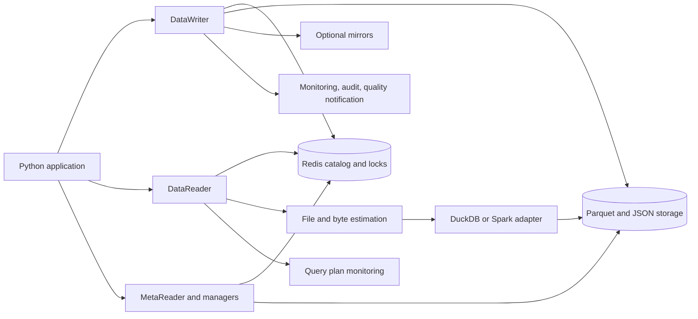

# Platform overview

SuperTable is a Python library for querying versioned Parquet tables whose current metadata is held in Redis. The active source tree implements data writes, deletion vectors, compaction, SQL reads, metadata access, role management, staging metadata, result-stream jobs, mirroring, audit logging, and monitoring/quality helpers.

The primary objects are an organization, a SuperTable within that organization, and SimpleTables within the SuperTable. See [data model](03_data_model.md) for their stored representations.

## Components

| Component | Implemented responsibility | Chapter |
| --- | --- | --- |
| `SuperTable`, `SimpleTable` | Namespace creation, snapshot access, resource updates, deletion, export. | [Data model](03_data_model.md) |
| Storage backends | Local, S3, MinIO, Azure Blob, and GCS object/file operations. | [Storage](04_storage.md) |
| `RedisCatalog` | Current roots/leaves, versions, row IDs, configuration, identities, and service metadata. | [Catalog](05_redis_catalog.md) |
| `DataWriter`, processing helpers | Arrow ingestion, key-based replacement, tombstones, statistics, compaction. | [Writer](06_data_writer.md) |
| `Staging`, `SuperPipe` | Stage files/indexes and Redis pipe definitions. | [Ingestion](07_ingestion.md) |
| Redis/file locking | Token ownership and lease-based coordination. | [Locking](08_locking.md) |
| Parser, estimator, executors | SQL classification, named-table resolution, file pruning, engine execution. | [Query engine](09_query_engine.md) |
| `DataReader`, OData helpers | Polars results, Arrow streams, service-oriented stream preparation. | [Reader](10_data_reader.md) |
| Role/user managers | Permission checks, role-name lookup, column and row policies, identity records. | [RBAC](11_rbac.md) |
| Audit | Context, event queue, Redis/Parquet sinks, readers and administrative helpers. | [Audit](12_audit.md) |
| Format mirrors | Copies and format metadata for Parquet, Delta, and Iceberg outputs. | [Mirroring](13_mirroring.md) |
| Monitoring/quality | Operation metrics, partition helpers, profiling/rules and scheduling. | [Monitoring](14_monitoring.md) |

Sources: [package exports](../supertable/__init__.py), [writer](../supertable/data_writer.py), [reader](../supertable/data_reader.py), [storage factory](../supertable/storage/storage_factory.py).

## Writing data

An application passes Arrow input and a role name to `DataWriter.write`. The writer validates the table/key arguments, assigns internal row IDs and a timestamp, and acquires the table lock. Empty overwrite keys append; nonempty keys retire matching existing rows through deletion-vector entries. `newer_than` can reject stale replacements.

New Parquet files, tombstone parts, and statistics artifacts are written before the new snapshot JSON. The writer then publishes the leaf pointer and increments the SuperTable root. The live table is the resource list in its current snapshot with the referenced deletions applied. Compaction rewrites selected resources and advances that snapshot.

This is a sequence of storage and catalog operations, not a transaction spanning storage and Redis. Historic resources remain on disk/object storage until a separate deletion operation removes them. Details and failure boundaries are in [data writer](06_data_writer.md).

## Reading data

`DataReader` classifies the SQL, resolves physical tables, checks existence and role access, and estimates the referenced resources. Stored row-group statistics can remove files that cannot satisfy supported predicates. File paths and referenced columns are then passed to the executor.

The DuckDB path constructs views over the selected Parquet files, applies deletion vectors and row/column restrictions, and executes the rewritten SQL. Results are available as a Polars DataFrame or an Arrow batch stream. `fullscan=True` bypasses estimator predicate pruning; it does not disable authorization or deletions.

AUTO routing can choose a registered active Spark cluster using estimated bytes and cluster thresholds. The current Spark adapter discards its stream handle in a `finally` return, which prevents normal result delivery through the shared executor. Explicit DuckDB selection is used throughout the SDK examples. See [query engine](09_query_engine.md) for the exact selection and limitation.

Reads resolve current leaf metadata. There is no high-level `as_of` query parameter or atomic organization-wide snapshot. Table snapshot history is exposed through predecessor paths and catalog helpers.

## Access and integration boundaries

The SDK receives role names; it does not establish an authenticated user session for every call. Applications must resolve the caller's authority before selecting a role. High-level read/write/metadata entry points enforce their operation permissions. Metadata checks use table membership and do not apply READ row/column filters; whole-SuperTable metadata requires a wildcard table grant. Direct storage/catalog access and some low-level helpers are not equivalent authorization boundaries.

Creating a SuperTable initializes the reserved `superadmin` role and a default `superuser`. Role/user mutation methods require an acting role with `RBAC` permission. Reads can enforce allowed columns and row filters, with the actual role-type exceptions documented in [RBAC](11_rbac.md).

The package provides OData-oriented stream and policy helpers, but no HTTP server. Result-stream jobs serialize query results into storage and publish job state in Redis. They are separate from stage/pipe ingestion metadata. `SuperPipe` has no built-in worker that consumes stage files in this checkout.

## Optional outputs and background work

Mirroring is invoked synchronously after native snapshot publication. Its failure does not undo the write. Mirrors copy physical data resources and do not apply native tombstone deletion vectors, so they can contain rows hidden by a native read.

Monitoring and audit use independent queues/sinks. Audit is disabled by default; enabled loggers are created lazily. Quality ingestion notifications and a callable scheduler support asynchronous profiling, but scheduling requires explicit startup. None of these side effects provides an atomic acknowledgment for the native write.

Each corresponding chapter documents the available helpers, their startup requirements, and failure behavior. [Implementation gaps](TODO.md) collects issues that materially limit these interfaces.

## Deployment inputs

A process needs Python dependencies, Redis, and its selected storage backend. DuckDB executes within the Python process. Spark requires separately available Thrift infrastructure and registered cluster configuration; cloud backends require their optional dependencies and credentials.

Configuration is loaded early. The home-directory module creates or selects an application home and changes the working directory during import, so configure environment variables and absolute application paths before importing SuperTable. See [configuration](02_configuration.md) and [Python SDK](15_python_sdk.md).
