# Project Dependency Model

## Package Structure (Inferred from Imports)

The flat files map to a logical package structure under `supertable`:

| File (flat)            | Logical Package Path                          |
|------------------------|-----------------------------------------------|
| `defaults.py`          | `supertable.config.defaults`                  |
| `homedir.py`           | `supertable.config.homedir`                   |
| `storage_interface.py` | `supertable.storage.storage_interface`         |
| `storage_factory.py`   | `supertable.storage.storage_factory`           |
| `minio_storage.py`     | `supertable.storage.minio_storage`             |
| `s3_storage.py`        | `supertable.storage.s3_storage`                |
| `permissions.py`       | `supertable.rbac.permissions`                  |
| `row_column_security.py`| `supertable.rbac.row_column_security`         |
| `filter_builder.py`    | `supertable.rbac.filter_builder`               |
| `role_manager.py`      | `supertable.rbac.role_manager`                 |
| `user_manager.py`      | `supertable.rbac.user_manager`                 |
| `access_control.py`    | `supertable.rbac.access_control`               |
| `locking_backend.py`   | `supertable.locking.locking_backend`           |
| `file_lock.py`         | `supertable.locking.file_lock`                 |
| `redis_lock.py`        | `supertable.locking.redis_lock`                |
| `locking.py`           | `supertable.locking` (facade)                  |
| `helper.py`            | `supertable.utils.helper`                      |
| `timer.py`             | `supertable.utils.timer`                       |
| `sql_parser.py`        | `supertable.utils.sql_parser`                  |
| `plan_stats.py`        | `supertable.engine.plan_stats`                 |
| `engine_common.py`     | `supertable.engine.engine_common`              |
| `duckdb_pinned.py`     | `supertable.engine.duckdb_pinned`              |
| `duckdb_transient.py`  | `supertable.engine.duckdb_transient`           |
| `executor.py`          | `supertable.engine.executor`                   |
| `data_estimator.py`    | `supertable.engine.data_estimator`             |
| `data_classes.py`      | `supertable.data_classes`                      |
| `redis_connector.py`   | `supertable.redis_connector`                   |
| `redis_catalog.py`     | `supertable.redis_catalog`                     |
| `super_table.py`       | `supertable.super_table`                       |
| `simple_table.py`      | `supertable.simple_table`                      |
| `super_pipe.py`        | `supertable.super_pipe`                        |
| `query_plan_manager.py`| `supertable.query_plan_manager`                |
| `processing.py`        | `supertable.processing`                        |
| `plan_extender.py`     | `supertable.plan_extender`                     |
| `staging_area.py`      | `supertable.staging_area`                      |
| `data_reader.py`       | `supertable.data_reader`                       |
| `data_writer.py`       | `supertable.data_writer`                       |
| `meta_reader.py`       | `supertable.meta_reader`                       |
| `monitoring_writer.py` | `supertable.monitoring_writer`                 |
| `monitoring_reader.py` | `supertable.monitoring_reader`                 |
| `history_cleaner.py`   | `supertable.history_cleaner`                   |
| `spark_thrift.py`      | `supertable.engine.spark_thrift`               |

---

## Dependency Tiers (Bottom-Up)

### Tier 0 — Leaf / No Internal Dependencies
These files depend only on external libraries, not on other project files.

- **`data_classes.py`** — `dataclass` definitions (`TableDefinition`, `Reflection`, `SuperSnapshot`, `RbacViewDef`)
- **`permissions.py`** — `Permission`, `RoleType` enums
- **`filter_builder.py`** — pure logic, no imports from project
- **`locking_backend.py`** — `LockingBackend` abstract enum
- **`plan_stats.py`** — `PlanStats` (likely a dataclass/container)
- **`storage_interface.py`** — `StorageInterface` ABC
- **`helper.py`** — utility functions (`generate_filename`, `collect_schema`, `generate_hash_uid`, `dict_keys_to_lowercase`)

### Tier 1 — Depends Only on Tier 0
- **`defaults.py`** → (external only: `os`, `logging`, `colorlog`, `dotenv`)
- **`row_column_security.py`** → `permissions.py`
- **`sql_parser.py`** → `data_classes.py`

### Tier 2 — Depends on Tier 0–1
- **`timer.py`** → `defaults.py`
- **`homedir.py`** → `defaults.py`
- **`storage_factory.py`** → `defaults.py`, `storage_interface.py`
- **`minio_storage.py`** → `storage_interface.py`
- **`s3_storage.py`** → `storage_interface.py`
- **`redis_catalog.py`** → `defaults.py`
- **`redis_connector.py`** → `defaults.py`
- **`redis_lock.py`** → `defaults.py`
- **`file_lock.py`** → `defaults.py`
- **`monitoring_writer.py`** → `defaults.py`
- **`engine_common.py`** → `defaults.py`
- **`query_plan_manager.py`** → `defaults.py`, `helper.py`, `sql_parser.py`

### Tier 3 — Depends on Tier 0–2
- **`user_manager.py`** → `defaults.py`, `redis_catalog.py`
- **`role_manager.py`** → `row_column_security.py`, `defaults.py`, `redis_catalog.py`
- **`super_table.py`** → `defaults.py`, `role_manager.py`, `user_manager.py`, `storage_factory.py`, `storage_interface.py`, `redis_catalog.py`
- **`super_pipe.py`** → `defaults.py`, `redis_catalog.py`
- **`locking.py`** → `defaults.py`, `homedir.py`, `locking_backend.py`, `file_lock.py`
- **`staging_area.py`** → `defaults.py`, `storage_factory.py`, `redis_catalog.py`
- **`duckdb_transient.py`** → `defaults.py`, `query_plan_manager.py`, `sql_parser.py`, `data_classes.py`, `engine_common.py`
- **`duckdb_pinned.py`** → `defaults.py`, `query_plan_manager.py`, `sql_parser.py`, `data_classes.py`, `engine_common.py`

### Tier 4 — Depends on Tier 0–3
- **`access_control.py`** → `defaults.py`, `data_classes.py`, `role_manager.py`, `permissions.py`, `filter_builder.py`, `sql_parser.py`
- **`simple_table.py`** → `defaults.py`, `redis_catalog.py`, `super_table.py`, `helper.py`, `access_control.py`
- **`processing.py`** → `locking.py`, `helper.py`, `defaults.py`, `storage_factory.py`
- **`executor.py`** → `plan_stats.py`, `timer.py`, `query_plan_manager.py`, `sql_parser.py`, `duckdb_transient.py`, `duckdb_pinned.py`, `data_classes.py`
- **`spark_thrift.py`** → `defaults.py`, `query_plan_manager.py`, `sql_parser.py`, `data_classes.py`, `redis_catalog.py`, `engine_common.py`

### Tier 5 — Depends on Tier 0–4
- **`data_estimator.py`** → `defaults.py`, `data_classes.py`, `super_table.py`, `helper.py`, `plan_stats.py`, `timer.py`, `access_control.py`, `redis_catalog.py`, `sql_parser.py`
- **`plan_extender.py`** → `query_plan_manager.py`, `plan_stats.py`, `storage_factory.py`, `super_table.py`, `monitoring_writer.py`
- **`meta_reader.py`** → `access_control.py`, `redis_catalog.py`, `super_table.py`, `simple_table.py`
- **`history_cleaner.py`** → `defaults.py`, `super_table.py`, `redis_catalog.py`, `access_control.py`
- **`monitoring_reader.py`** → `storage_factory.py`, `duckdb_transient.py`, `data_estimator.py`

### Tier 6 — Top-Level Orchestrators
- **`data_reader.py`** → `defaults.py`, `storage_factory.py`, `storage_interface.py`, `timer.py`, `query_plan_manager.py`, `sql_parser.py`, `plan_extender.py`, `plan_stats.py`, `access_control.py`, `data_estimator.py`, `executor.py`, `data_classes.py`
- **`data_writer.py`** → `defaults.py`, `monitoring_writer.py`, `super_table.py`, `simple_table.py`, `timer.py`, `processing.py`, `access_control.py`, `redis_catalog.py`

---

## Dependency Graph (Mermaid)

```mermaid
graph TD
    subgraph "Tier 0 — Leaf"
        data_classes
        permissions
        filter_builder
        locking_backend
        plan_stats
        storage_interface
        helper
    end

    subgraph "Tier 1"
        defaults
        row_column_security --> permissions
        sql_parser --> data_classes
    end

    subgraph "Tier 2"
        timer --> defaults
        homedir --> defaults
        storage_factory --> defaults
        storage_factory --> storage_interface
        minio_storage --> storage_interface
        s3_storage --> storage_interface
        redis_catalog --> defaults
        redis_connector --> defaults
        redis_lock --> defaults
        file_lock --> defaults
        monitoring_writer --> defaults
        engine_common --> defaults
        query_plan_manager --> defaults
        query_plan_manager --> helper
        query_plan_manager --> sql_parser
    end

    subgraph "Tier 3"
        user_manager --> defaults
        user_manager --> redis_catalog
        role_manager --> row_column_security
        role_manager --> defaults
        role_manager --> redis_catalog
        super_table --> defaults
        super_table --> role_manager
        super_table --> user_manager
        super_table --> storage_factory
        super_table --> storage_interface
        super_table --> redis_catalog
        super_pipe --> defaults
        super_pipe --> redis_catalog
        locking --> defaults
        locking --> homedir
        locking --> locking_backend
        locking --> file_lock
        staging_area --> defaults
        staging_area --> storage_factory
        staging_area --> redis_catalog
        duckdb_transient --> defaults
        duckdb_transient --> query_plan_manager
        duckdb_transient --> sql_parser
        duckdb_transient --> data_classes
        duckdb_transient --> engine_common
        duckdb_pinned --> defaults
        duckdb_pinned --> query_plan_manager
        duckdb_pinned --> sql_parser
        duckdb_pinned --> data_classes
        duckdb_pinned --> engine_common
    end

    subgraph "Tier 4"
        access_control --> defaults
        access_control --> data_classes
        access_control --> role_manager
        access_control --> permissions
        access_control --> filter_builder
        access_control --> sql_parser
        simple_table --> defaults
        simple_table --> redis_catalog
        simple_table --> super_table
        simple_table --> helper
        simple_table --> access_control
        processing --> locking
        processing --> helper
        processing --> defaults
        processing --> storage_factory
        executor --> plan_stats
        executor --> timer
        executor --> query_plan_manager
        executor --> sql_parser
        executor --> duckdb_transient
        executor --> duckdb_pinned
        executor --> data_classes
        spark_thrift --> defaults
        spark_thrift --> query_plan_manager
        spark_thrift --> sql_parser
        spark_thrift --> data_classes
        spark_thrift --> redis_catalog
        spark_thrift --> engine_common
    end

    subgraph "Tier 5"
        data_estimator --> defaults
        data_estimator --> data_classes
        data_estimator --> super_table
        data_estimator --> helper
        data_estimator --> plan_stats
        data_estimator --> timer
        data_estimator --> access_control
        data_estimator --> redis_catalog
        data_estimator --> sql_parser
        plan_extender --> query_plan_manager
        plan_extender --> plan_stats
        plan_extender --> storage_factory
        plan_extender --> super_table
        plan_extender --> monitoring_writer
        meta_reader --> access_control
        meta_reader --> redis_catalog
        meta_reader --> super_table
        meta_reader --> simple_table
        history_cleaner --> defaults
        history_cleaner --> super_table
        history_cleaner --> redis_catalog
        history_cleaner --> access_control
        monitoring_reader --> storage_factory
        monitoring_reader --> duckdb_transient
        monitoring_reader --> data_estimator
    end

    subgraph "Tier 6 — Top-Level"
        data_reader --> defaults
        data_reader --> storage_factory
        data_reader --> storage_interface
        data_reader --> timer
        data_reader --> query_plan_manager
        data_reader --> sql_parser
        data_reader --> plan_extender
        data_reader --> plan_stats
        data_reader --> access_control
        data_reader --> data_estimator
        data_reader --> executor
        data_reader --> data_classes
        data_writer --> defaults
        data_writer --> monitoring_writer
        data_writer --> super_table
        data_writer --> simple_table
        data_writer --> timer
        data_writer --> processing
        data_writer --> access_control
        data_writer --> redis_catalog
    end
```

---

## Key Observations

1. **`defaults.py`** is the most depended-upon file (imported by ~25 files). Changes here ripple everywhere.
2. **`redis_catalog.py`** is a critical hub — used by `super_table`, `simple_table`, `data_writer`, `data_estimator`, `staging_area`, `role_manager`, `user_manager`, `history_cleaner`, `meta_reader`, `spark_thrift`, `super_pipe`.
3. **`data_classes.py`** and **`sql_parser.py`** are foundational shared types used across engine, RBAC, and reader/writer layers.
4. **`super_table.py`** is a central domain object depended on by most higher-tier modules.
5. **`storage_interface.py` → `storage_factory.py` → `minio_storage.py` / `s3_storage.py`** form a clean storage abstraction layer.
6. **RBAC chain**: `permissions.py` → `row_column_security.py` → `role_manager.py` → `access_control.py` (consumed by readers/writers/meta).
7. **Engine chain**: `engine_common.py` → `duckdb_pinned.py` / `duckdb_transient.py` → `executor.py` → `data_reader.py`.
8. **`data_reader.py`** and **`data_writer.py`** are the top-level orchestrators with the widest dependency fan-out.
9. **`redis_connector.py`** has no internal dependents in these files — likely consumed externally or by `redis_catalog.py` at runtime.
10. **External note**: `data_writer.py` imports `supertable.mirroring.mirror_formats.MirrorFormats` — a module **not present** in the uploaded files.
